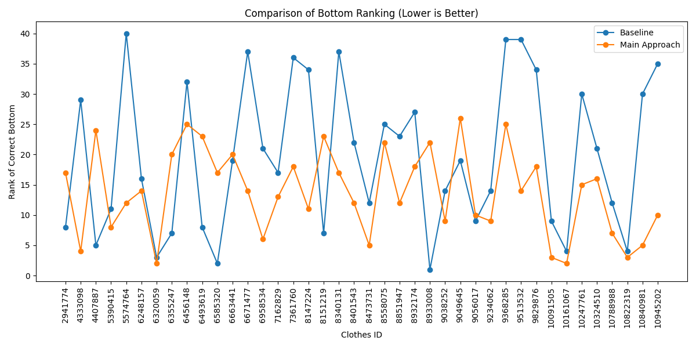

# 👗 Intelligent Clothing Tagging and Pairing System

A deep learning-based system that automatically tags clothing images with attributes and recommends compatible outfit combinations based on style, color, and fabric. The project includes attribute prediction, color classification, outfit compatibility modeling, and a web interface for user interaction.

---

## 📝 Project Introduction

This project aims to build an intelligent system for clothing attribute tagging and outfit pairing. It leverages deep learning models to:

- **Tag clothing images** with fine-grained attributes (style, fabric, pattern, etc.)
- **Classify dominant colors** in clothing images
- **Recommend compatible outfit pairs** (e.g., top and bottom) based on learned compatibility
- **Provide a web interface** for users to upload images and receive recommendations

---

## 📁 Project Structure

```
Intelligent_Clothing_Tagging_and_Pairing_System/
│
├── app.py                      # Flask web backend
├── requirements.txt            # Python dependencies (see below)
├── README.md                   # Project documentation
│
├── static/                     # Static files for web
│   ├── user_top/
│   ├── user_bottom/
│   └── net_bottom/
│
├── templates/                  # HTML templates for Flask
│   └── index.html
│
├── model/                      # Model code and checkpoints
│   ├── attr_label/             # Attribute tagging model
│   │   ├── model.py
│   │   ├── best_tagger.pth
│   │   └── list_attr_cloth.txt
│   ├── color_label/            # Color classifier
│   │   ├── color_classifier.pt
│   │   └── ...
│   ├── main_approach/          # Outfit compatibility model (main)
│   │   ├── model.py
│   │   ├── train.py
│   │   ├── attr_extractor.py
│   │   ├── color_util.py
│   │   └── ...
│   └── baseline/               # Baseline model and scripts
│       ├── train.py
│       ├── inference.py
│       ├── pair_train/
│       ├── Top/
│       ├── Bottom/
│       └── ...
│
└── test_code/                  # Testing scripts
    └── filter/
        ├── filter.py
        ├── list_filter.txt
        └── ...
 
```

---

## 🌟 Overview

This repository contains all code, models, and scripts for the Intelligent Clothing Tagging and Pairing System. The system predicts clothing attributes and colors, and recommends compatible outfit pairs using deep learning.

---

## ⚙️ Prerequisites

- **Python version:** 3.8+
- **Required packages:**  
  All dependencies are listed in `requirements.txt`.  
  Main packages include:
  - `torch`, `torchvision` (deep learning)
  - `numpy` (numerical operations)
  - `flask`, `werkzeug` (web backend)
  - `pillow` (image processing)
  - `matplotlib`, `tqdm` (analysis and visualization)
- **Installation:**  
  Install all dependencies with:
  ```bash
  pip install -r requirements.txt
  ```
- **CUDA:**  
  *Optional.* If you have a CUDA-capable GPU and want to accelerate training/inference, install the CUDA-compatible versions of `torch` and `torchvision`.  
  If you do not use CUDA, the code will run on CPU by default.

---

## 🚀 Usage

### 1. Backend (Flask API)

- Make sure all dependencies are installed (see requirements).
- Place your trained model files in the correct locations as referenced in `app.py`.
- Run the backend server:
  ```bash
  python app.py
  ```
- The Flask server will start (default: http://127.0.0.1:5000).

### 2. Frontend

- The frontend is served by Flask using HTML templates (e.g., `templates/index.html`).
- Open your browser and go to [http://127.0.0.1:5000](http://127.0.0.1:5000) to use the web interface.

### 3. Model Training

- **Attribute Tagging:**  
  Train with `model/attr_label/train.py`
- **Color Classification:**  
  Train with `model/color_label/train.py`
- **Outfit Compatibility:**  
  Train with `model/main_approach/train.py` (main) or `model/baseline/train.py` (baseline)

### 4. Inference & Evaluation

- Use scripts in `model/attr_label/`, `model/color_label/`, `model/main_approach/`, and `model/baseline/` for inference and evaluation.

---

## 🛠️ Hyperparameters

Key hyperparameters (see each training script for details):

- **Attribute Tagging:**  
  - Epochs: 10  
  - Batch size: 64  
  - Learning rate: 1e-4  
- **Color Classification:**  
  - Epochs: 10  
  - Batch size: 8  
  - Learning rate: 1e-3  
- **Outfit Compatibility:**  
  - Epochs: 10  
  - Batch size: 64  
  - Learning rate: 5e-4 (main), 1e-3 (test)  
  - Model: MLP with hidden_dim=512

---

## 📊 Experiment Results

<p align="left">
  
</p>

| Metric           | Baseline | Main Approach |
|------------------|----------|--------------|
| Average Rank     | 19.80 | 13.78 |
| Top-5 Accuracy   | 15.0 | 17.5 |
| Lower Rank   | 10/40 | 30/40 |

---

## 📝 Notes

- `requirements.txt` lists all Python dependencies needed to run and train the models.
- If you modify the backend code, restart the Flask server to apply changes.
- For dataset preparation, see scripts in the `dataset/` directory.

